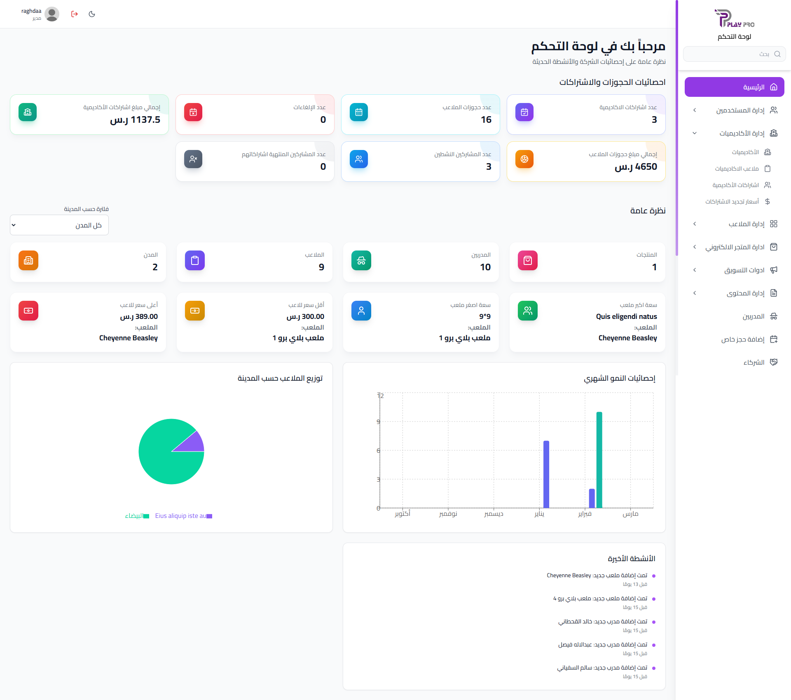
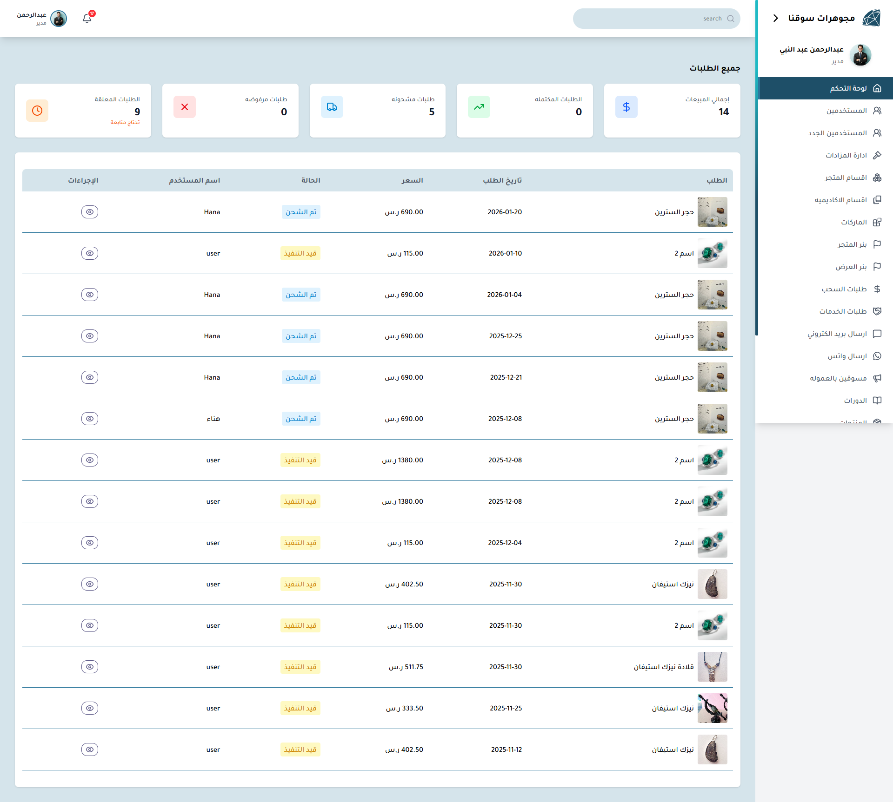

<h1 align="center">Hi 👋 I'm Mostafa Ibrahem</h1>
<h3 align="center">Frontend Engineer | React & Next.js Specialist | Scalable Systems Builder</h3>

I build scalable, production-ready web applications with clean architecture and high performance.

---

## 🚀 About Me

💻 Frontend Engineer specialized in **React & Next.js**  
⚛️ Advanced knowledge of Hooks, Performance & State Management  
🛒 Built complete **E-commerce ecosystems** (Platform + Dashboard)  
💬 Implemented **real-time systems** & complex UI flows  
🔐 Designed secure authentication with **JWT & Refresh Tokens**  
📈 Performance-first mindset  

> I don’t just build UI — I build systems.

---

## 🛠 Tech Stack

### ⚛️ Frontend
React.js | Next.js | React Query | Redux / Context API | Zustand | React Hook Form | Swiper.js

### 🎨 Styling
Tailwind CSS | Ant Design | Styled Components | Responsive & Accessible UI

### 🔐 Backend / APIs
Node.js | REST APIs | Axios | JWT Authentication | Refresh Token Handling

### 🧠 Architecture & Concepts
SOLID Principles | Custom Hooks Architecture | Reusable UI Systems | Performance Optimization | State Management Patterns | Next.js SSR/SSG/ISR

---

## 💼 Projects

### 🛒 Sawaqna Ecosystem

**🌐 Main Platform**  
Live: [souqna eCommerce](https://souqnaecommerce.netlify.app/)  
> Production-level E-commerce platform built with scalable React architecture and optimized data fetching.

**🖥 Dashboard (Private)**  
Internal admin system for managing products, orders, users & analytics.

  

---

### 🎮 PlayPro Ecosystem

**🌍 Main Platform**  
Live: [playprodammam.com](https://playprodammam.com)  
> Sports & activities booking platform with optimized API handling and responsive UI.

**🖥 Dashboard (Private)**  
Management system for bookings, users & activities control.

---

### 💎 Jewelry Souqna

**🌍 Store**  
Live: [jewelry.souqna-sa.com](https://jewelry.souqna-sa.com/)  
> Elegant online jewelry store with seamless browsing experience.

**🖥 Dashboard (Private)**  
Product & order management system.

  

---

### 💡 Bahj Platform

Live: [bahj-platform.netlify.app](https://bahj-platform.netlify.app/)  
> Frontend implementation with scalable component design & responsive UI.

---

### 🌐 Furas (Freelance)

Live: [furas-7pmt.onrender.com](https://furas-7pmt.onrender.com)  
> Modern scalable freelance project with React & Next.js.

---

## 📊 GitHub Analytics

  

  

---

## 📫 Connect With Me

  <a href="https://www.linkedin.com/in/mostafa-ibrahem-elsayed/" target="_blank">LinkedIn</a> • 
  <a href="mailto:mostafaibrahem194@gmail.com">Email</a> • 
  <a href="https://twitter.com/mostafaibrahem" target="_blank">Twitter</a>

⭐ Always Learning | Always Building | Always Improving

